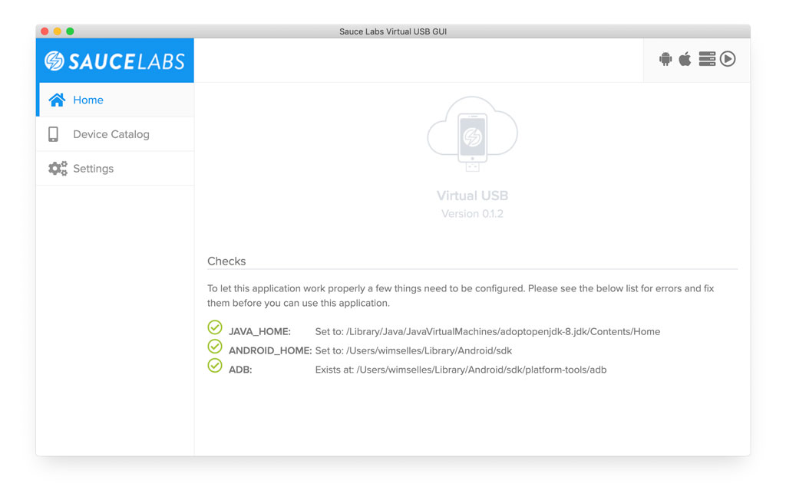
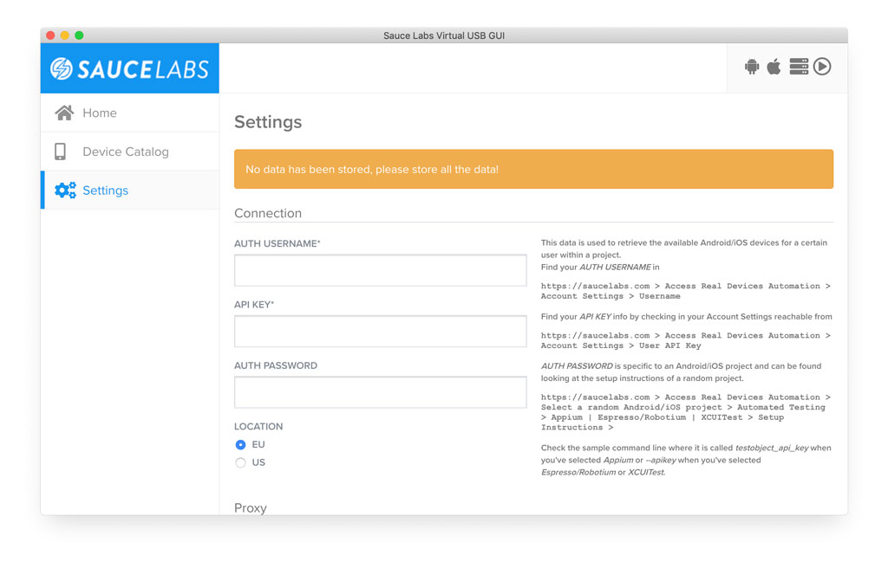
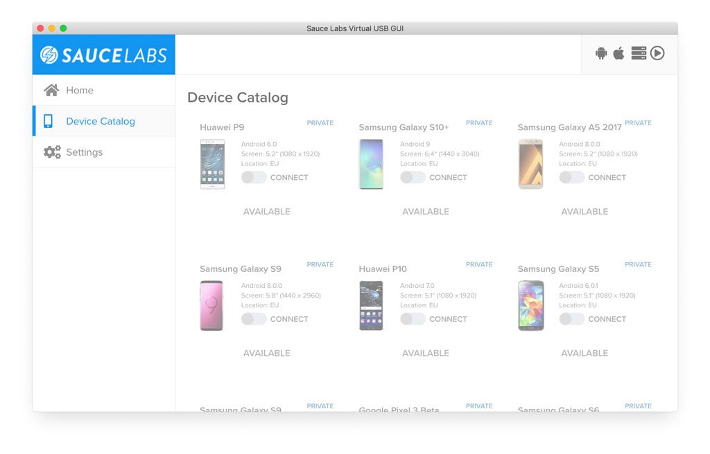
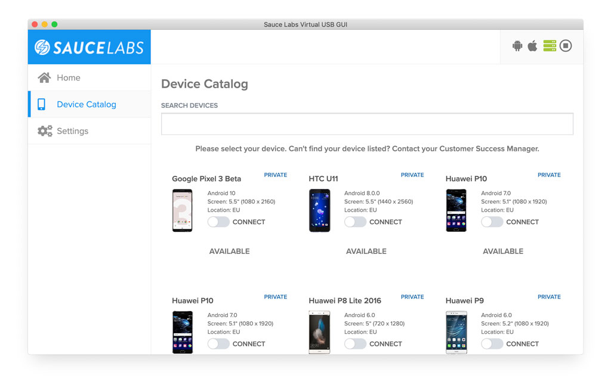
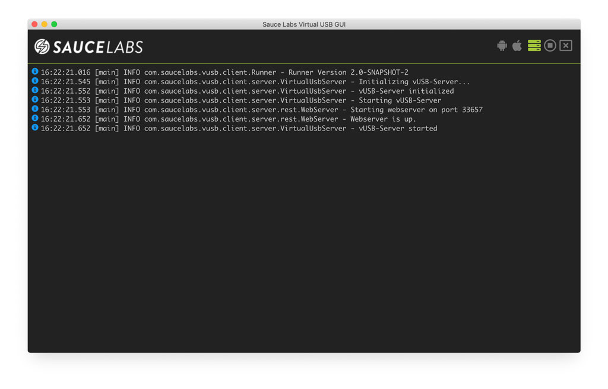
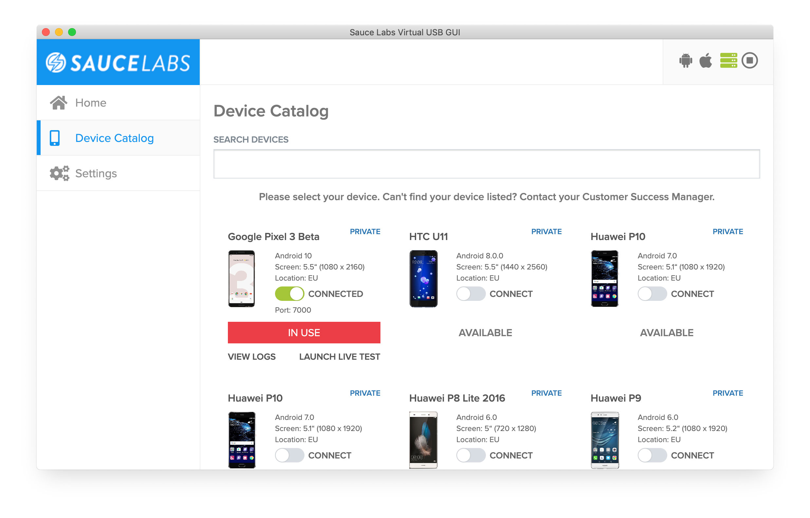
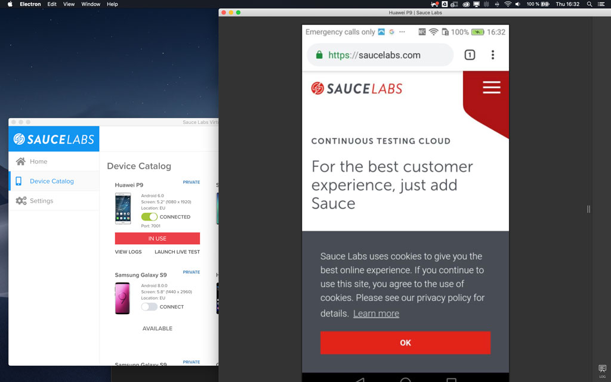
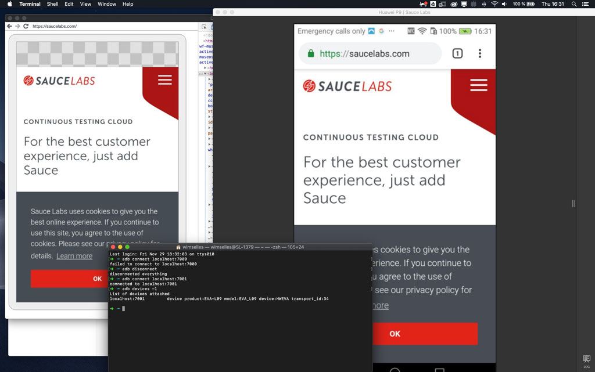

# saucelabs-vusb-gui
This project is an Open Source Virtual USB GUI for Sauce Labs Virtual USB. It provides a simple GUI to start an Android* VUSB session with only a few clicks.

> **NOTES:** 
> - iOS is in an early access mode, contact your Sauce Labs Customer Success Manager to learn more
> - Sauce Labs Virtual USB will only work if you are having Private devices in your Sauce Labs Real Device cloud
> - Windows is currently **not** supported!

## How to use
### Prerequisites
This client currently only support Android. To be able to work with Android you need to have the following on your local machine:

- JAVA added to your path
- Latest version of ADB installed on your machine
- (optional) Latest version of Android Studio installed on your local machine

There are enough tutorials on the internet that will explain yoy how to achieve the above.

## Features
- Connect to a **new** VUSB session through the UI
- Connect to an **existing** session through the UI. This can be a running Appium session of a running manual session.
- Change VUSB server settings through the UI
 
### Installing
Download the latest version of the client from [here](https://github.com/wswebcreation/saucelabs-vusb-gui/releases), be aware of the fact that currently only Mac and Linux are supported.
After you have installed the client check the *Home* screen if there are no environmental issues, see below, if you have them please fix them and restart the app.

Then go to *Settings* and fill the needed data. The first time you will see a screen like below

You can adjust the server settings by scrolling down.

When all *Settings* have been stored the *Device Catalog* can be used (if you didn't store the data properly clicking on the *Device Catalog* will automatically bring you back to the *Settings*).
You will see a screen like this.

You can't select a device because you first need to start the server, this can be done by clicking on the play-button. The screen will update and look like this.

.

To see the logs of the server click on the green icon, the logs can also be cleared like you normally would do with a terminal. 
The monitor can be closed by clicking on the cross.

Connect to a device by clicking on the switch. After a few minutes the switch will change from `Connecting` to `Connected` and the device will get an `In Use` badge, see below.

When you now click on *LAUNCH LIVE TEST* a new window will be opened and a new fresh VUSB session will be started.

If you want to connect the device to your local machine then take the port number that is shown in the GUI and connect it with ADB like you normally would do.
In this case the device needs to be connected to port `7001` which leads to this command 

    adb connect localhost:7001

This will give you the opportunity to connect the device to for example Chrome and debug the website like this.

 

## TODO:
- [ ] Verify that the device connection is really killed
- [ ] Sort the devices, they are now only shown based on how we get them with the API call
- [ ] Add a generic notification/error handler
- [ ] Implement proxy for getting the data from the API through a proxy
- [ ] Some other stuff that I don't know now =)

## FAQ
### I'm not seeing any devices in the device catalog
Please make sure you have private devices assigned to your account. If you still can't see them file an issue [here](https://github.com/wswebcreation/saucelabs-vusb-gui/issues).

### Why can't I see iOS devices, even though I have private iOS devices assigned to my account
Virtual USB for iOS is in an early access mode. This app doesn't support that yet. Please contact your Sauce Labs Customer Success Manager to learn more about VUSB for iOS.

### Can I use this app on a Windows machine?
No, the current Virtual USB runner only supports Linux and Mac, see [here](https://wiki.saucelabs.com/display/DOCS/Android+Virtual+USB+Changelog) for the latest runners if you want to use them without this GUI.

### I'm getting al kinds of errors in my home screen telling me that `JAVA_HOME, `ANDROID_HOME` and or `ADB` are not working
Make sure you have set up your environment for using Android on your local machine. Use Google as your biggest friend.

### Is this product build and maintained by Sauce Labs?
No, this product is build by myself because I wanted to learn building Apps with Electron and ReactJS. I thought that a simple UI for the Sauce Labs VUSB solution would be a nice project to start with.

### Why is the source code not provided
The source code will be provided in a few weeks.

## Credits
This app has been build with [electron-react-boilerplate](https://github.com/electron-react-boilerplate/electron-react-boilerplate).
